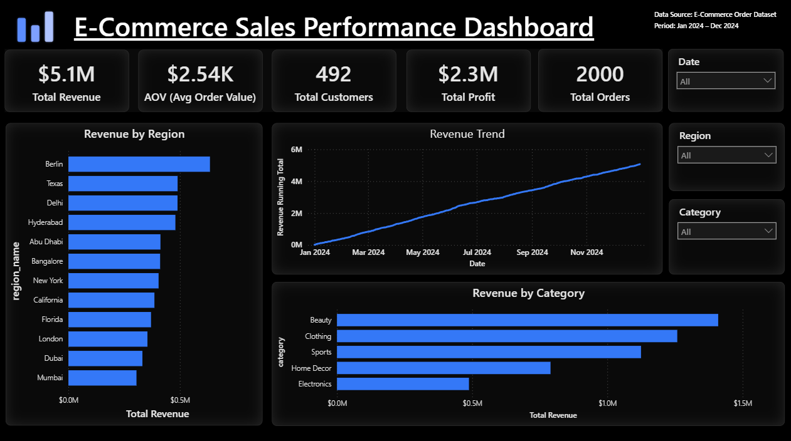

# 🛍️ E-Commerce Sales Performance Dashboard (Power BI)

This project is an interactive **E-Commerce Sales Performance Dashboard** built using **Power BI**.  
It provides insights into **revenue trends, customer behavior, regional performance, and product category contribution**, helping support **data-driven business decisions**.

---

## 📚 Dataset Source

A sample **e-commerce transactional dataset** consisting of:

- Orders
- Customers
- Regions
- Products
- Order Items

The dataset is used for **learning and portfolio demonstration purposes**.

---

## 🛠 Tools & Technologies Used

| Tool / Technology | Purpose |
|------------------|---------|
| **SQL Server** | Data extraction and validation |
| **Power Query** | Data cleaning and transformation |
| **Power BI Desktop** | Data modeling, report building, and visualization |
| **DAX** | KPI calculations and time intelligence |
| **GitHub** | Project hosting and documentation |

---

## 🔧 Data Preparation Workflow

1. Loaded raw CSV datasets into **SQL Server**.
2. Cleaned and formatted data using **Power Query**.
3. Built a **Star Schema Data Model** in Power BI.
4. Created **DAX Measures** for business KPIs.
5. Designed an interactive dashboard with slicers and drill-down functionality.

---

## 💹 Key Performance Indicators (KPIs)

- **Total Revenue**
- **Total Profit**
- **Total Orders**
- **Unique Customers**
- **Average Order Value (AOV)**
- **Profit Margin %**
- **Revenue Over Time (Trend)**

---

## 📈 Dashboard Pages Included

| Page Name | Description |
|----------|-------------|
| **Sales Overview** | Key KPIs, region-wise revenue, category performance, and revenue trends |
| **Trend Analysis** | Month-to-month / daily revenue tracking and pattern recognition |
| **Product Insights** *(optional)* | Product contribution and best-selling items |
| **Customer Insights** *(optional)* | Customer segmentation and repeat purchase trends |

---

## 🖼 Dashboard Preview

> Main Overview Dashboard

---

## 🔍 Business Insights

- Certain **regions contribute significantly higher revenue** than others.
- Categories such as **Beauty, Clothing, and Sports** perform strongly.
- **Revenue trend analysis** highlights consistent month-over-month growth.
- **AOV remains stable**, indicating reliable customer spending behavior.

---

## 🚀 How to Use

1. Download the `.pbix` file from this repository.
2. Open it in **Power BI Desktop**.
3. Use the **slicers** to filter by:
   - Date Range  
   - Region  
   - Product Category  
4. Hover over charts to view details and interpretations.

---

## 👤 Author

**Mohammed Adeeb Siddiqui**  
_Data Analytics | SQL | Power BI | Python_

- GitHub: **https://github.com/adeebsidd22**
- LinkedIn: **https://www.linkedin.com/in/mohammed-adeeb-siddiqui-88776b33b/**
- Email: **mohadeebsid@gmail.com**

---

### ⭐ If you found this project useful, please **star the repository** to support my work!

